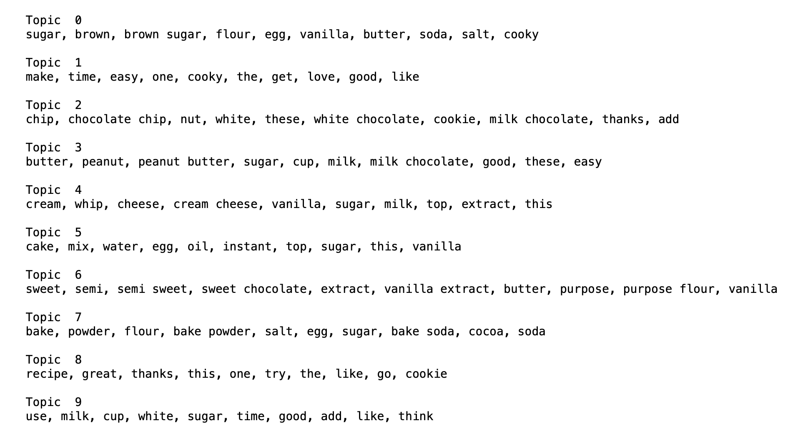

## Recipe Recommender

Goal
The goal of this project is to create a recipe recommendation system based on a recipe that a user is trying to make.

Data
I will be using the dataset from Food.com available in Kaggle[https://www.kaggle.com/shuyangli94/food-com-recipes-and-user-interactions?select=RAW_recipes.csv] which contains the recipes, ingredients list and also user reviews of the recipes. It consists of 180K+ recipes and 700K+ recipe reviews covering 18 years of user interactions and uploads.

Baseline Topic Modeling
For the MVP, I started off with a subset of the data which has recipes of desserts and sweets. While pre-processing the data, I removed all digits, punctuation, non-textual characters and common English stop words. I created a few baseline models using different algorithms such as NMF, LSA and LDA with CountVectorizer, TF-IDF. 

Here's a logical grouping of the topics identified from the dessert recipe subset:

Next steps
Looking at the topics, I will be using the Reviews dataset to limit the results of the recipe search which means only recipes that have 5 star or 4 star reviews are considered. Further I will be using just the recipe ingredients for making the recommendations. Next steps would be:
1) Increase the number of topics to see if it produces more coherent results 
2) Try using custom stop words to improvise the list 
3) Tune the min_df and max_df hyperparameters to observe the terms

Finally build a simple recommendation system using the ingredient terms given by the user and suggest recipes relevant to the keywords entered in the search box.
