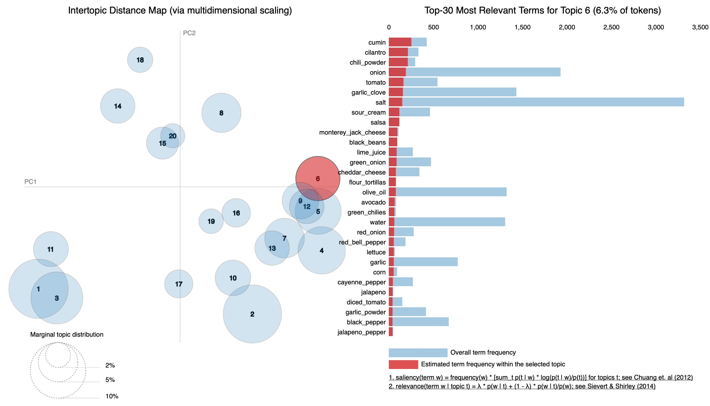

## Recipe Recommender System

The goal of this project is to build a recipe recommendation system based on a recipe that is chosen from the recipes dataset. This can help people to discover new recipes that they may want to try which further helps in planning grocery trips!

### Data
The [dataset](https://www.kaggle.com/shuyangli94/food-com-recipes-and-user-interactions) is from Kaggle which includes 2 csv files. One is the interactions file containing recipe IDs rated by user IDs and the other is raw recipes csv file containing 230,000 recipes with names, ID, ingredients, description, steps etc.

### Algorithms

NLP
While pre-processing the data, I removed all digits and punctuation, astop words, including some custom stop words (fresh, chopped, frozen etc). I also created a custom tokenizer to merge the ingredients(rather than creating n-grams) like Olive oil into Olive_oil, and to lemmatize all other tokens. I tried both CountVectorizer and TF-IDF Vectorizer with NMF and LDA.

### Topic Modeling
LDA is used for topic modeling and the final model has 20 topics.

Below is a interactive visual of the ingredient distribution in each topic, the chosen topic is clearly Mexican food:

### Tools
Python (pandas, numpy)
Regex
NLTK
Scikitlearn
Gensim
pyLDAvis
Cosine Similarity

### Communication
The slides and visuals are available in my [Github repository](https://github.com/pr-suresh/RecipeRecommender)

